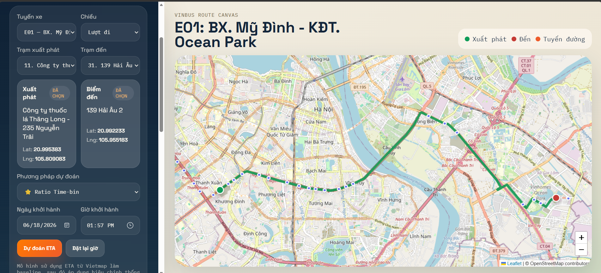
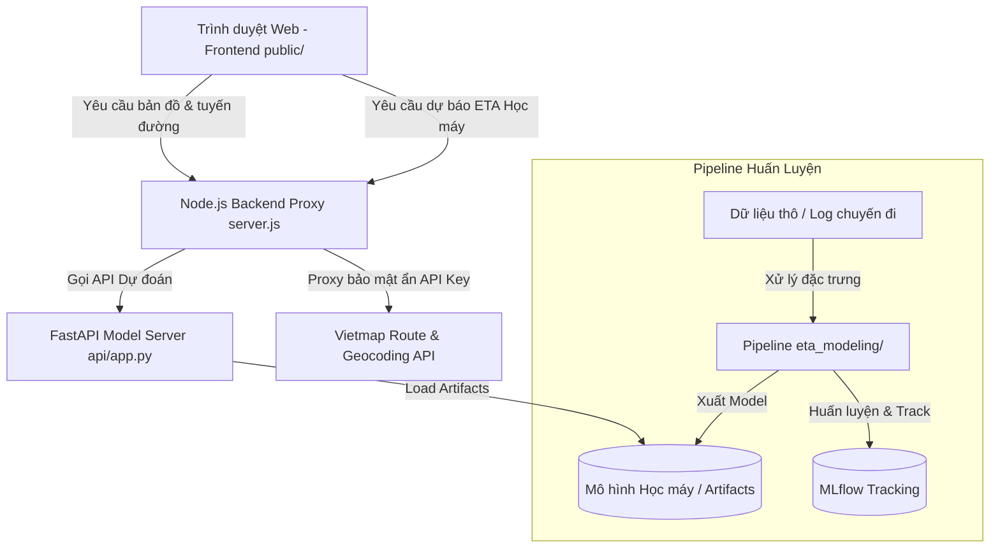

# Hệ Thống Dự Đoán Thời Gian Di Chuyển (ETA Prediction System)

Dự án này là một giải pháp tích hợp từ giao diện bản đồ trực quan đến các mô hình Học máy (Machine Learning) nhằm tối ưu hóa và dự đoán chính xác thời gian di chuyển thực tế (ETA - Estimated Time of Arrival) cho các chuyến đi. Hệ thống sử dụng Vietmap Route API làm nền tảng tuyến đường cơ sở (Baseline) và áp dụng các mô hình học máy tiên tiến để dự đoán sai số (Residual Correction), giúp nâng cao độ chính xác đáng kể so với kết quả thô từ API bản đồ.


---

## 1. Kiến Trúc Hệ Thống (System Architecture)

Hệ thống được thiết kế theo mô hình kiến trúc phân lớp nhằm đảm bảo tính bảo mật và hiệu năng:



### Chi tiết các thành phần:
- **Frontend (`public/`)**: Giao diện người dùng viết bằng HTML/CSS/JavaScript thuần, hiển thị bản đồ Leaflet, cho phép nhập địa chỉ điểm xuất phát/đích, trực quan hóa đường đi và so sánh ETA giữa các mô hình khác nhau.
- **Node.js Backend Proxy (`server.js`)**:
  - Đóng vai trò là cổng trung gian (API Gateway) kết nối với Vietmap API (Route v3, Search v4, Place v4).
  - Giúp ẩn đi `VIETMAP_API_KEY` hoàn toàn khỏi trình duyệt để bảo mật thông tin tài khoản.
  - Proxy các mảnh bản đồ (map tiles) nếu cấu hình, tránh lộ API Key tile.
- **Python FastAPI Server (`api/app.py`)**:
  - Cung cấp các API (`/api/eta/models`, `/api/eta/predict`) để phục vụ suy luận (Inference) thời gian thực từ các mô hình Machine Learning đã được huấn luyện.
  - Nạp các tệp mô hình dạng `.joblib` (scikit-learn/XGBoost) và `.pt` (PyTorch).
- **Pipeline Huấn Luyện (`eta_modeling/`)**: Quy trình khép kín xử lý dữ liệu đầu vào, chia tập dữ liệu theo thời gian thực tế (chronological split), tối ưu hóa tham số hyperparameter, huấn luyện mô hình và lưu lịch sử thử nghiệm qua MLflow.
---

## 2. Cấu Trúc Thư Mục (Folder Structure)

Dưới đây là cấu trúc thư mục chính của dự án và mô tả vai trò của từng thành phần:

```text
├── api/                       # Mã nguồn Python FastAPI phục vụ API dự đoán ETA học máy
│   └── app.py                 # File chạy chính của FastAPI server
├── docs/                      # Tài liệu mô tả hệ thống
├── eta_modeling/              # Thư mục huấn luyện mô hình sâu và XGBoost (MLflow pipeline)
│   ├── configs/               # Chứa file cấu hình tham số huấn luyện (config.yaml)
│   ├── src/                   # Mã nguồn Python (xử lý dữ liệu, thiết lập mô hình, huấn luyện)
│   └── artifacts/             # Kết quả lưu trữ mô hình và các chỉ số (plots, metrics, models)
├── model/                     # Thư mục chứa các script mô hình baseline và file lưu trữ cũ
├── public/                    # Tài nguyên giao diện người dùng (Frontend)
│   ├── index.html             # Trang giao diện chính hiển thị bản đồ Leaflet
│   └── map.js                 # Điều khiển giao diện bản đồ, xử lý vẽ tuyến đường và gọi API
├── residual_modeling/         # Thư mục nghiên cứu các phương pháp hiệu chỉnh thống kê
│   ├── baseline.ipynb         # Notebook khảo sát dữ liệu và mô hình baseline
│   ├── enhanced_method_1.ipynb# Notebook xây dựng phương pháp hiệu chỉnh thống kê nâng cao
│   ├── method3.ipynb          # Notebook nghiên cứu phương pháp hiệu chỉnh thống kê số 3
│   └── method_comparison.py   # Script so sánh hiệu năng các phương pháp thống kê
├── server.js                  # Backend Proxy (Node.js) kết nối Vietmap API và serve tĩnh Frontend
├── route.json                 # Cấu hình các tuyến đường xe buýt cố định phục vụ hiển thị nhanh
├── requirements.txt           # Danh sách thư viện Python phục vụ chạy mô hình
└── package.json               # Cấu hình package và các script chạy của Node.js
```

---

## 3. Hướng Dẫn Cài Đặt (Setup Instructions)

Hệ thống yêu cầu cài đặt cả môi trường Node.js (dành cho Backend Proxy & Frontend) và Python (dành cho mô hình Học máy).

### Môi trường Node.js (Web Server)
1. Cài đặt các thư viện Node.js:
   ```bash
   npm install
   ```
2. Tạo tệp cấu hình môi trường `.env` từ tệp ví dụ:
   ```bash
   copy .env.example .env
   ```
3. Cập nhật các thông số API Key trong tệp `.env`:
   ```env
   VIETMAP_API_KEY=your_vietmap_api_key_here
   # Cấu hình tuỳ chọn proxy map tiles nếu có
   VIETMAP_TILE_API_KEY=your_tile_api_key_here
   VIETMAP_TILE_URL_TEMPLATE=https://maps.vietmap.vn/maps/tiles/st/{z}/{x}/{y}.png
   ```
4. Khởi chạy Web Server:
   ```bash
   npm start
   ```
   Giao diện bản đồ sẽ khả dụng tại: `http://localhost:3000`.

### Môi trường Python (FastAPI & Machine Learning)
1. Tạo môi trường ảo Python và kích hoạt:
   ```bash
   python -m venv .venv
   # Windows:
   .\.venv\Scripts\activate
   # Linux/macOS:
   source .venv/bin/activate
   ```
2. Cài đặt các thư viện yêu cầu:
   ```bash
   pip install -r requirements.txt
   ```
3. Chạy FastAPI Model Server:
   ```bash
   python -m uvicorn api.app:app --host 127.0.0.1 --port 8000
   ```
   FastAPI sẽ chạy tại địa chỉ `http://127.0.0.1:8000`. Bây giờ Frontend trên trình duyệt có thể tự động tải danh sách mô hình và thực hiện dự đoán thời gian di chuyển.

---

## 4. Các Phương Pháp Sử Dụng & Giải Thích Kiến Trúc

Do tập dữ liệu thực tế hiện tại chưa đủ lớn và đa dạng để tránh hiện tượng quá khớp (overfitting) đối với các mô hình học sâu phức tạp (như MLP hay DeeprETA), hệ thống hiện tại đang sử dụng các **phương pháp hiệu chỉnh thống kê (Statistical Correction Methods)**. Đây là những phương pháp cực kỳ nhẹ, không cần huấn luyện mạng nơ-ron nặng nề, có tính ổn định toán học cao và chống nhiễu tốt dựa trên các phân phối thực tế.

Dưới đây là giải thích kiến trúc và công thức của **3 phương pháp thống kê chính** đã chọn:

### Phương pháp 1: Additive Global (Hiệu chỉnh cộng toàn cục)
* **Tổng quan**: Phương pháp này cộng thêm một giá trị sai số cố định vào ETA cơ sở của Vietmap, giả định rằng sai số lệch trung bình luôn không đổi đối với mọi hành trình bất kể thời gian hay thời tiết.
* **Công thức**:
  $$\text{ETA}_{\text{dự đoán}} = \text{ETA}_{\text{Vietmap}} + \text{Residual}_{\text{global\_median}}$$
  Trong đó:
  $$\text{Residual}_{\text{global\_median}} = \text{Median}\left(\{t_{actual, i} - t_{api, i}\}_{i \in \text{Train}}\right)$$
* **Ưu & Nhược điểm**:
  - *Ưu điểm*: Cực kỳ đơn giản, trực quan và không bị ảnh hưởng bởi các trường hợp ngoại lệ (outliers) nhờ sử dụng trung vị (median) thay vì trung bình cộng (mean).
  - *Nhược điểm*: Bỏ qua các đặc điểm động của thời gian (kẹt xe giờ cao điểm) và quãng đường.

### Phương pháp 2: Ratio Time-Bin (Hiệu chỉnh tỷ lệ theo khung giờ)
* **Tổng quan**: Phương pháp này chia một ngày thành các khung giờ dịch vụ cố định (Time-Bins) và tính toán tỷ số hiệu chỉnh (Ratio) đặc thù cho từng khung giờ. Phương pháp này mô phỏng ảnh hưởng của mật độ giao thông biến động theo thời gian thực tế trong ngày.
* **Định nghĩa các khung giờ (Time-Bins)**:
  - `early_morning`: 4h - 6h sáng (Giao thông thông thoáng)
  - `morning_peak`: 7h - 9h sáng (Cao điểm sáng)
  - `off_peak_day`: 10h - 14h chiều (Thấp điểm trưa)
  - `evening_peak`: 15h - 18h tối (Cao điểm chiều)
  - `late_evening`: 19h - 21h đêm (Tối muộn)
  - `other`: Ngoài khung giờ trên
* **Công thức**:
  $$\text{ETA}_{\text{dự đoán}} = \text{ETA}_{\text{Vietmap}} \times \text{Ratio}_{\text{bin}}$$
  Trong đó $\text{Ratio}_{\text{bin}}$ là tỷ lệ trung vị giữa thời gian thực tế và baseline trong khung giờ tương ứng.
* **Kiến trúc làm mượt co ngót (Shrinkage Smoothing)**:
  Để giải quyết vấn đề thiếu dữ liệu mẫu (data sparsity) ở một số khung giờ cụ thể, hệ thống áp dụng cơ chế làm mượt co ngót:
  $$\text{Ratio}_{\text{smoothed}} = w \times \text{Ratio}_{\text{bin\_median}} + (1 - w) \times \text{Ratio}_{\text{global\_median}}$$
  Với trọng số làm mượt:
  $$w = \frac{n}{n + k}$$
  Trong đó $n$ là số dòng dữ liệu thực tế của khung giờ đó trên tập Train, và $k$ là tham số điều hướng (được tối ưu hóa qua tập Validation). Nếu một khung giờ có rất ít dữ liệu ($n$ nhỏ), tỷ số hiệu chỉnh sẽ tự động co về tỷ số toàn cục để tránh dự báo sai lệch lớn.

### Phương pháp 3: Log Ratio Global (Hiệu chỉnh Log-Tỷ lệ toàn cục)
* **Tổng quan**: Phương pháp này chuyển tỷ lệ thực tế/baseline sang miền logarithm trước khi tính toán. Điều này giúp xử lý các phân phối dữ liệu bị lệch nặng (skewed distribution) - tình trạng rất phổ biến trong dữ liệu giao thông do có những chuyến đi bị kẹt xe kéo dài đột biến.
* **Công thức**:
  $$\text{ETA}_{\text{dự đoán}} = \text{ETA}_{\text{Vietmap}} \times e^{\text{LogRatio}_{\text{global}}}$$
  Trong đó giá trị log-tỷ lệ toàn cục được tính bằng:
  $$\text{LogRatio}_{\text{global}} = \text{Median}\left(\left\{\ln\left(\frac{t_{actual, i}}{t_{api, i}}\right)\right\}_{i \in \text{Train}}\right)$$
* **Kiến trúc toán học**:
  - Việc lấy logarithm giúp đưa phân phối nhân tính (multiplicative distribution) về dạng phân phối cộng tính (additive) cân đối hơn.
  - Sử dụng hàm số mũ ($e^x$) khi dự đoán giúp đảm bảo giá trị ETA dự đoán luôn dương và tự nhiên đối với mô hình thang tỷ lệ.

---

## 5. Các Chỉ Số Đánh Giá (Evaluation Metrics)

Hệ thống đánh giá và so sánh hiệu quả của các mô hình trên tập dữ liệu kiểm thử độc lập (Test Set chiếm 15% dữ liệu được chia theo dòng thời gian) thông qua tập hợp các metrics sau:

| Metric | Tên Đầy Đủ | Công Thức / Giải Thích | Mục Tiêu Ý Nghĩa |
| :--- | :--- | :--- | :--- |
| **MAE** | Mean Absolute Error | $\frac{1}{n}\sum |y_i - \hat{y}_i|$ | Tính sai số trung bình (theo giây). MAE càng nhỏ, độ chính xác trung bình càng cao. |
| **RMSE** | Root Mean Squared Error | $\sqrt{\frac{1}{n}\sum (y_i - \hat{y}_i)^2}$ | Phạt nặng các sai số lớn. Đo lường mức độ ổn định của dự đoán. |
| **MAPE** | Mean Absolute Percentage Error | $\frac{100\%}{n}\sum \left\|\frac{y_i - \hat{y}_i}{y_i}\right\|$ | Sai số phần trăm trung bình. Hữu ích khi so sánh các chuyến đi dài và ngắn. |
| **p50** | Median Absolute Error | Phân vị thứ 50 của sai số tuyệt đối. | Đại diện cho sai số của đa số các chuyến đi bình thường (ít bị ảnh hưởng bởi điểm dị biệt). |
| **p95** | 95th Percentile Error | Phân vị thứ 95 của sai số tuyệt đối. | Đại diện cho kịch bản sai số tệ nhất (extreme case). Rất quan trọng trong kinh doanh logistics. |
| **MAE Impr. %** | MAE Improvement Percentage | $\frac{\text{MAE}_{\text{baseline}} - \text{MAE}_{\text{model}}}{\text{MAE}_{\text{baseline}}} \times 100\%$ | Tỷ lệ cải thiện sai số trung bình của mô hình so với gọi API Vietmap gốc. |
| **p95 Impr. %** | p95 Improvement Percentage | $\frac{\text{p95}_{\text{baseline}} - \text{p95}_{\text{model}}}{\text{p95}_{\text{baseline}}} \times 100\%$ | Tỷ lệ cải thiện độ lệch trong tình huống xấu nhất. |
| **Latency** | Inference Latency | Thời gian xử lý trung bình mỗi mẫu (ms/sample). | Đánh giá khả năng đáp ứng thời gian thực (Real-time serving) của mô hình. |

### So sánh & Quản lý Thử nghiệm
Khi chạy quy trình so sánh:
```bash
cd eta_modeling
python -m src.training.compare_models --config configs/config.yaml
```
Kết quả so sánh chi tiết sẽ được tự động ghi nhận vào bảng so sánh tại `artifacts/metrics/model_comparison.csv` và trực quan hóa qua biểu đồ cột tại `artifacts/plots/model_comparison_mae_p95.png`. 

Bạn có thể mở giao diện quản lý **MLflow** để xem biểu đồ trực quan, tham số huấn luyện chi tiết của từng lượt chạy:
```bash
mlflow ui
```
Sau đó truy cập trình duyệt tại: `http://127.0.0.1:5000`.
