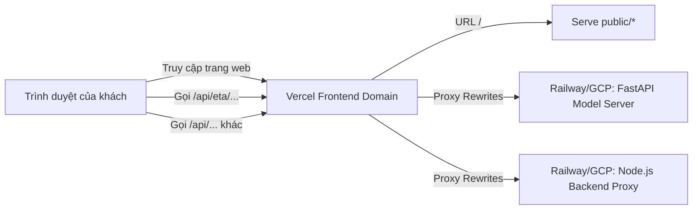

# Hướng Dẫn Deploy Hệ Thống Dự Đoán ETA (Vercel & Railway / Google Cloud)

Tài liệu này hướng dẫn chi tiết cách triển khai (deploy) sản phẩm để chạy trực tuyến (có link demo) cho cả 3 thành phần:
1. **Frontend (HTML/CSS/JS thuần)**: Triển khai trên **Vercel** (Miễn phí, tối ưu CDN).
2. **Node.js Backend Proxy (`server.js`)**: Triển khai trên **Railway** hoặc **Google Cloud Run** (Xử lý các API proxy đến Vietmap API).
3. **Model API (`api/app.py` - FastAPI)**: Triển khai trên **Railway** hoặc **Google Cloud Run** (Chạy các thuật toán học máy dự đoán ETA).

---

## 🚀 Luồng Kết Nối Production (Architecture)

Để tránh lỗi chặn tên miền chéo (**CORS**) từ trình duyệt và không cần hardcode địa chỉ URL của Backend vào mã nguồn Frontend, chúng ta sẽ cấu hình **Vercel Rewrites**:



---

## 🛠️ Bước Chuẩn Bị: Sửa Client-side Code để tự nhận diện domain

Trước khi deploy, hãy đổi cấu hình `ETA_API_BASE` trong [public/app.js](file:///d:/vinAI/GSM/Map/ETA-prediction/public/app.js) để frontend tự động gửi request về cùng domain (Vercel sẽ làm nhiệm vụ proxy chuyển hướng tiếp sang Railway/GCP).

Mở file [public/app.js](file:///d:/vinAI/GSM/Map/ETA-prediction/public/app.js) dòng 1:
```diff
-const ETA_API_BASE = "http://localhost:8000";
+const ETA_API_BASE = "";
```
*Giải thích: Khi đặt `ETA_API_BASE = ""` rỗng, Frontend sẽ gọi `/api/eta/predict` trực tiếp trên domain Vercel hiện tại của bạn.*

---

## 1. Hướng Dẫn Triển Khai Backend Lên Railway (Khuyến Nghị - Nhanh Nhất)

Railway là nền tảng tối ưu nhất cho cả Node.js và Python khi chạy chung một Repo (Monorepo). Bạn chỉ cần đẩy code lên GitHub và tạo 2 Service trên cùng một dự án Railway.

### Dự án 1: Triển khai Python FastAPI Model Server
1. Truy cập [Railway.app](https://railway.app) và tạo một dự án mới từ GitHub repository của bạn.
2. Railway sẽ tự động phân tích và cài đặt Python từ tệp `requirements.txt` ở thư mục gốc.
3. Cấu hình **Start Command** (Câu lệnh khởi chạy) trong tab **Settings** của Service này:
   ```bash
   python -m uvicorn api.app:app --host 0.0.0.0 --port $PORT
   ```
4. Đổi tên Service này thành `eta-model-api`.
5. Tạo **Public Domain** cho service này trong tab **Settings** (Ví dụ: `https://eta-model-api-production.up.railway.app`).

### Dự án 2: Triển khai Node.js Backend Proxy
1. Trong cùng dự án Railway đó, chọn **New** -> **GitHub Repo** để thêm một Service mới trỏ cùng vào Repo của bạn.
2. Railway sẽ tự nhận diện đây là Node.js vì có tệp `package.json` và chạy lệnh khởi động `npm start` mặc định (lệnh này sẽ chạy `node server.js`).
3. Cấu hình **Variables** (Biến môi trường) cho Service Node.js này:
   - `VIETMAP_API_KEY`: Key dịch vụ định tuyến của bạn.
   - `VIETMAP_TILE_API_KEY`: Key bản đồ nền (nếu có).
   - `VIETMAP_TILE_URL_TEMPLATE`: Template tile URL (nếu có).
4. Đổi tên Service này thành `node-backend-proxy`.
5. Tạo **Public Domain** cho service này (Ví dụ: `https://node-backend-proxy-production.up.railway.app`).

---

## 2. Hướng Dẫn Triển Khai Backend Lên Google Cloud Run (Phương Án Thay Thế)

Google Cloud Run chạy dưới dạng các Container độc lập nên bạn cần viết `Dockerfile` cho từng Service.

### Bước 1: Container hóa hai dịch vụ
Tạo hai file Dockerfile ở các vị trí tương ứng:

#### 🐳 Dockerfile cho Node.js Backend (`Dockerfile.node` ở thư mục gốc):
```dockerfile
FROM node:20-slim
WORKDIR /app
COPY package*.json ./
RUN npm ci --only=production
COPY server.js route.json ./
COPY public/ ./public/
EXPOSE 3000
CMD ["node", "server.js"]
```

#### 🐳 Dockerfile cho Python FastAPI Model Server (`Dockerfile.python` ở thư mục gốc):
```dockerfile
FROM python:3.10-slim
WORKDIR /app
COPY requirements.txt .
RUN pip install --no-cache-dir -r requirements.txt
COPY api/ ./api/
COPY eta_modeling/ ./eta_modeling/
COPY residual_modeling/ ./residual_modeling/
EXPOSE 8000
CMD ["python", "-m", "uvicorn", "api.app:app", "--host", "0.0.0.0", "--port", "8000"]
```

### Bước 2: Build và Deploy lên Cloud Run
Chạy các lệnh gcloud CLI (hoặc liên kết GitHub qua Cloud Build Console):

```bash
# 1. Deploy Node backend proxy
gcloud run deploy node-backend-proxy \
  --source . \
  --command "node server.js" \
  --env-vars-file .env \
  --allow-unauthenticated \
  --port 3000

# 2. Deploy FastAPI backend
gcloud run deploy eta-model-api \
  --source . \
  --command "python -m uvicorn api.app:app --host 0.0.0.0 --port 8000" \
  --allow-unauthenticated \
  --port 8000
```
Sau khi hoàn thành, bạn sẽ nhận được 2 URL Cloud Run dạng `https://...run.app`.

---

## 3. Triển Khai Frontend Lên Vercel & Cấu Hình Vercel Rewrites

Khi đã có URL Public của hai Service Backend trên (ở đây giả sử là Railway), ta tiến hành deploy FE lên Vercel.

### Bước 1: Tạo cấu hình `vercel.json` ở thư mục gốc dự án
Tạo tệp [vercel.json](file:///d:/vinAI/GSM/Map/ETA-prediction/vercel.json) để định tuyến các API request từ Frontend về đúng Backend tương ứng:

```json
{
  "version": 2,
  "cleanUrls": true,
  "rewrites": [
    {
      "source": "/api/eta/:path*",
      "destination": "https://eta-model-api-production.up.railway.app/api/eta/:path*"
    },
    {
      "source": "/api/:path*",
      "destination": "https://node-backend-proxy-production.up.railway.app/api/:path*"
    },
    {
      "source": "/(.*)",
      "destination": "/public/$1"
    }
  ]
}
```
*(Thay thế link `https://...up.railway.app` bằng URL thực tế mà bạn nhận được từ Railway hoặc Google Cloud Run).*

### Bước 2: Deploy lên Vercel
1. Truy cập [Vercel.com](https://vercel.com).
2. Tạo dự án mới và liên kết với GitHub repository của bạn.
3. Cấu hình dự án trên Vercel:
   - **Framework Preset**: Chọn `Other` (hoặc `None`).
   - **Root Directory**: Để trống (thư mục gốc).
   - **Build Command**: Để trống.
   - **Output Directory**: `public` (hoặc để trống vì `vercel.json` đã điều hướng trang chủ `/` vào `/public/`).
4. Click **Deploy**.

Sau khi Vercel deploy hoàn tất, bạn sẽ nhận được một địa chỉ web duy nhất (ví dụ: `https://eta-prediction-map.vercel.app`). Khi truy cập link này, bản đồ sẽ hiển thị đầy đủ, gọi được API định tuyến Vietmap và tự động lấy kết quả dự đoán ETA từ FastAPI model mà không gặp bất cứ lỗi CORS nào!
